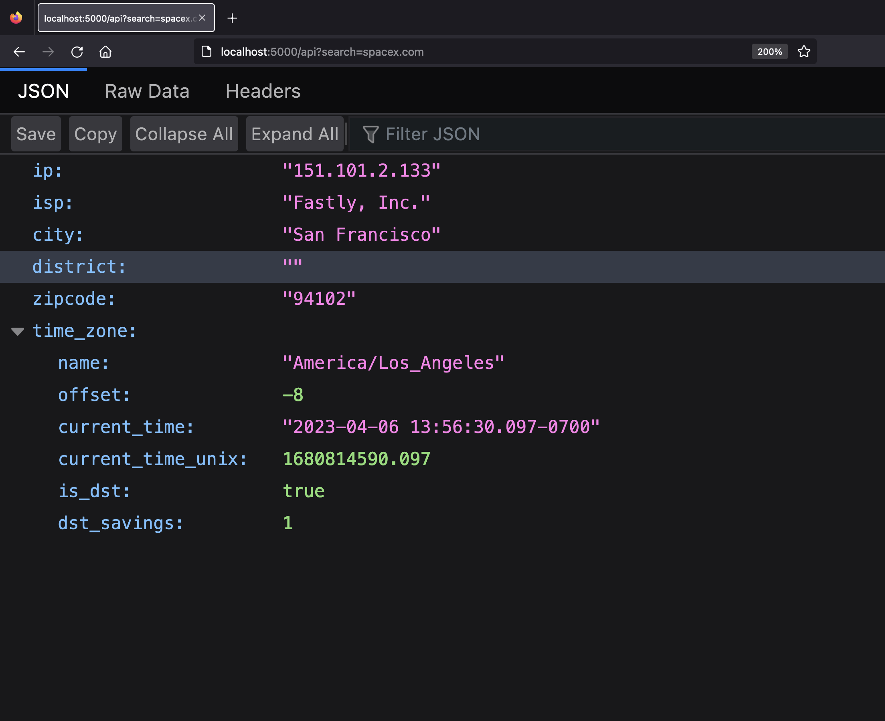

# Domain name to IP address lookup microservice



_The backend for the IP address tracker_

## How to run the project

1. `git clone https://github.com/AngeliqueDF/ip-address-tracker-microservice.git MY_FOLDER_NAME`
2. `cd MY_FOLDER_NAME`
3. `npm install`
4. `npm run dev`
5. The server will be listening at `http://localhost:5000`. See below for the endpoints.

## Features

- Validate an IP address.
- Find the IP address of any domain name (handles URLs entered with or without the protocol).
- Uses ipgeolocation.io.

## Technologies

- Node
- `express`

## Description

I wrote this module to replace an external API I needed to find the IP address of a given domain name. It is used in the IP address tracker app.

## API

### `GET` /api/search?={search}

Find the IP address of a domain name.

#### Parameters

| Name   | Type   | Description                                                                          |
| ------ | ------ | ------------------------------------------------------------------------------------ |
| search | string | The domain name or IP address searched. Example "google.com" or "https://google.com" |

#### Response

| Status code | Description                                                                                                               |
| ----------- | ------------------------------------------------------------------------------------------------------------------------- |
| 200         | **search** is a valid domain name, or an IPv4 or IPv6 address. The server will return the response from the external API. |

---

| Status code | Description                            |
| ----------- | -------------------------------------- |
| 404         | **search** is an invalid search query. |

```json
{
	"message": "Could not find information from the search provided. Make sure to enter a valid the domain name or IP address.",
	"result": null
}
```

---

## Status

The server is live and hosted on heroku. But it could use improvements.

### Planned changes

- [ ] Improve security.
- [ ] Restrict allowed origins.

## Author

- [@AngeliqueDF on GitHub.](https://github.com/AngeliqueDF)
- [Visit my website.](https://adf.dev)
- [View my Frontend Mentor profile.](https://www.frontendmentor.io/profile/AngeliqueDF)
